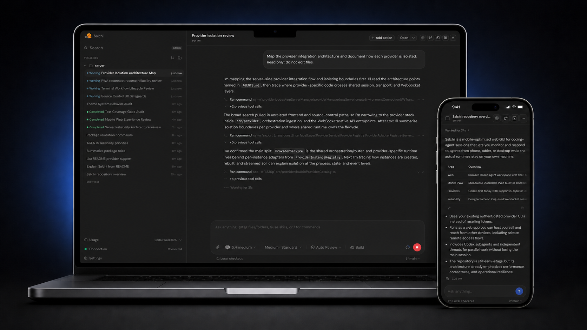
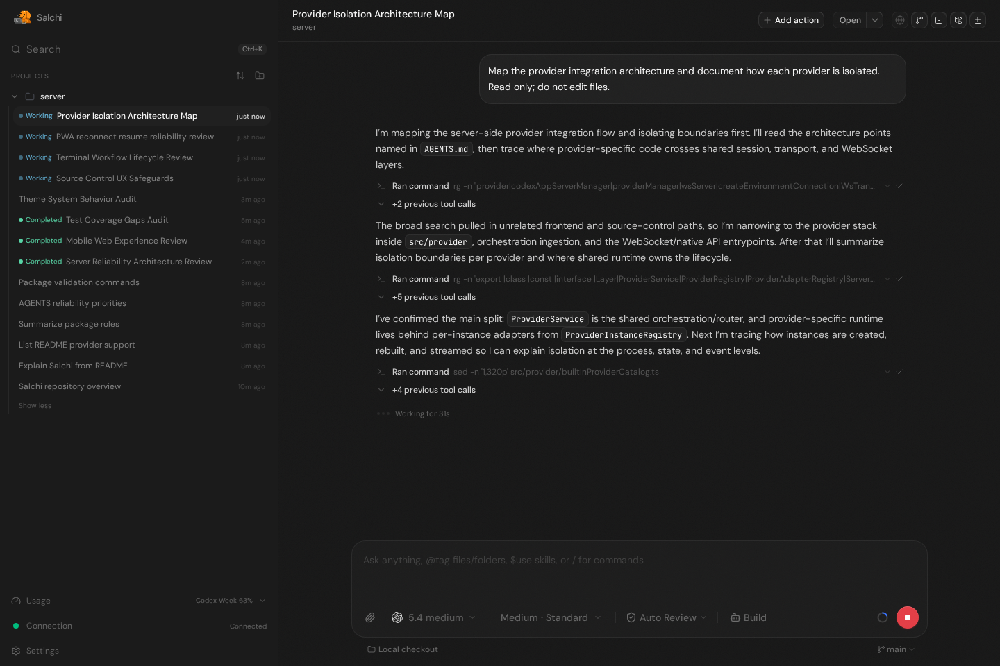
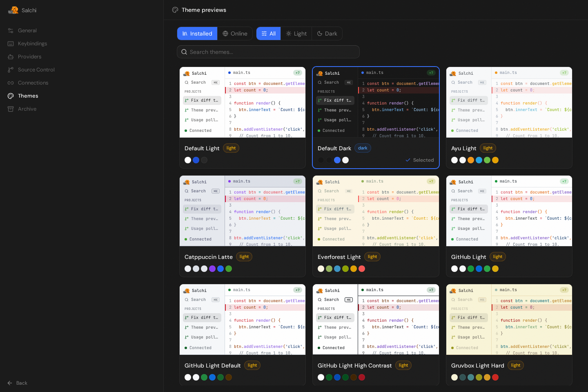
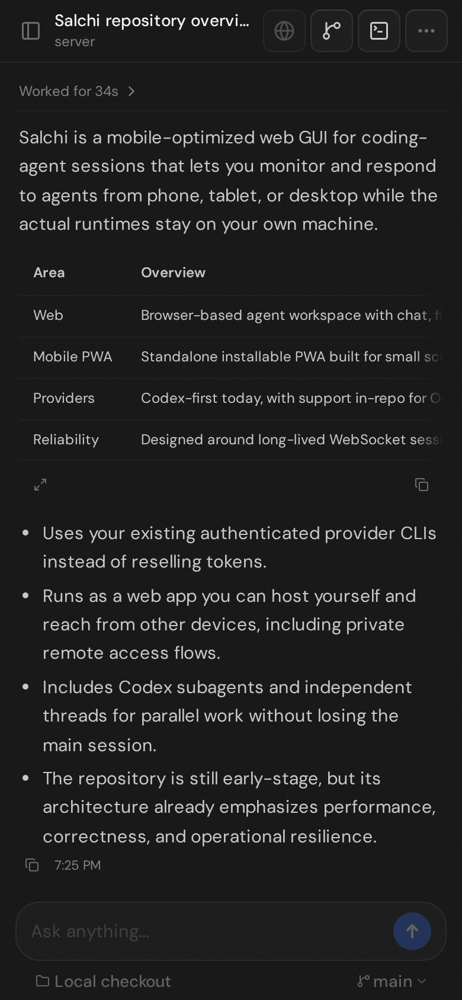
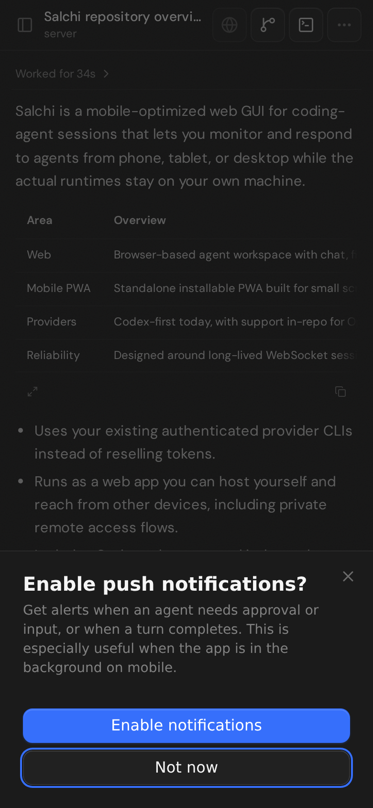

<p align="center">
  
</p>

# Salchi

Salchi is a mobile-optimized web GUI for keeping up with coding-agent sessions
from your phone, tablet, or desktop. It currently supports OpenAI/Codex, Claude,
Cursor, and OpenCode, with more providers coming soon. Bring the AI
subscriptions you already use; Salchi connects to your authenticated provider
CLIs instead of reselling tokens.

<p align="center">
  
</p>

## Demo

https://github.com/user-attachments/assets/c9f8687a-de73-4aef-b614-98a9eb0a5629

## Why Salchi?

Salchi focuses on mobile-first agent consumption:

- A mobile-optimized PWA for checking in on coding-agent sessions, reading
  progress, and responding while away from your main machine.
- A web agent GUI you can run from your own VPS or Mac, then access from your
  phone, tablet, or desktop while keeping the agent runtime on the machine with
  your projects.

That makes Salchi useful when you want:

- Use your existing AI subscriptions for Codex, Claude, Cursor, or OpenCode
  instead of paying for a separate token bundle.
- Private remote access through `npx salchi@latest`, the desktop app, or Tailscale Serve
  without exposing your editor to the public internet.
- One web surface for many providers, including Claude, OpenAI/Codex, Cursor,
  and OpenCode.
- Built-in file explorer for browsing project files alongside agent sessions.
- Source control views for reviewing local changes without switching tools.
- Codex subagents for splitting focused work out from the main conversation.
- Independent threads for running separate AI loops while keeping your current
  session intact.
- PDF attachments for asking agents to inspect specs, reports, and other
  documents.
- Codex chat image generation for creating visual assets from the same
  conversation surface.
- PWA push notifications for agent activity. On mobile, install Salchi to the
  Home Screen first so notifications can work.
- Local microphone dictation powered by `whisper.cpp`, with selectable Tiny,
  Base, and Small English models so you can balance transcription accuracy
  against CPU and memory use on your VPS or computer. On supported Linux hosts,
  `whisper.cpp` and the selected model install automatically in the background.
- Mobile-first PWA polish for coding-agent workflows that need to stay useful on
  small screens.

## Installation

> [!WARNING]
> Salchi currently supports OpenAI/Codex, Claude, Cursor, and OpenCode.
> Install and authenticate at least one provider before use:
>
> - OpenAI/Codex: install [Codex CLI](https://developers.openai.com/codex/cli) and run `codex login`
> - Claude: install [Claude Code](https://claude.com/product/claude-code) and run `claude auth login`
> - Cursor: install and authenticate the Cursor agent CLI
> - OpenCode: install [OpenCode](https://opencode.ai) and run `opencode auth login`

### Run without installing

Requires Node.js `^22.16`, `^23.11`, or `>=24.10`.

```bash
npx --yes salchi@latest
```

Salchi stays attached to the terminal and prints a pairing URL. Open that URL in your browser.

### Tailscale quick start on macOS

Use this when you want to run Salchi on your Mac and access it privately from
your phone, tablet, or another computer. This uses Tailscale Serve, not Funnel,
so the URL stays inside your tailnet.

1. Create a Tailscale account at [tailscale.com/start](https://tailscale.com/start).
   This creates your private tailnet.
2. Install [Tailscale](https://tailscale.com/download) on the Mac that will run
   Salchi and on each device that should open it, then sign in to the same
   account on all devices.
3. In the [Tailscale DNS settings](https://login.tailscale.com/admin/dns), keep
   MagicDNS enabled and enable HTTPS certificates.
4. Install and authenticate at least one provider CLI from the warning above on
   the Mac.
5. Open Terminal on the Mac, change into the project you want Salchi to manage,
   and confirm Tailscale is connected:

```bash
cd ~/projects/my-app
tailscale status
```

6. Start a headless Salchi server and keep macOS awake while it is running:

```bash
caffeinate -ims npx salchi@latest serve --tailscale-serve --port 4888
```

Salchi prints a pairing URL like:

```text
https://your-mac.your-tailnet.ts.net/pair#token=...
```

Open that URL from another device signed into the same tailnet.

7. **Optional:** To enable PWA push notifications, follow
   [Tailscale Serve for PWA Push Notifications](./docs/tailscale-serve-pwa-push.md).

Use a non-default Tailscale HTTPS port with:

```bash
caffeinate -ims npx salchi@latest serve \
  --tailscale-serve \
  --tailscale-serve-port 8443 \
  --port 4888
```

Stop the default Tailscale Serve route afterward with:

```bash
tailscale serve --https=443 off
```

If you used `--tailscale-serve-port 8443`, stop that route with
`tailscale serve --https=8443 off`.

`caffeinate` keeps macOS awake while Salchi is running, but it will not reliably keep a Mac awake with the lid closed. Keep the lid open, or use clamshell mode with power connected and an external display, keyboard, and mouse.

### Desktop app

Install the latest version of the desktop app from [GitHub Releases](https://github.com/JoseRFelix/salchi/releases).

## Some notes

We are very very early in this project. Expect bugs.

We are not accepting contributions yet.

Observability guide: [docs/observability.md](./docs/observability.md)

Local dictation guide: [docs/local-dictation.md](./docs/local-dictation.md)

## Screenshots

<p align="center">
  
  
</p>

<p align="center">
  
  
</p>

## If you REALLY want to contribute still.... read this first

Before local development, prepare the environment and install dependencies:

```bash
# Optional: only needed if you use mise for dev tool management.
mise install
bun install .
```

Read [CONTRIBUTING.md](./CONTRIBUTING.md) before opening an issue or PR.
